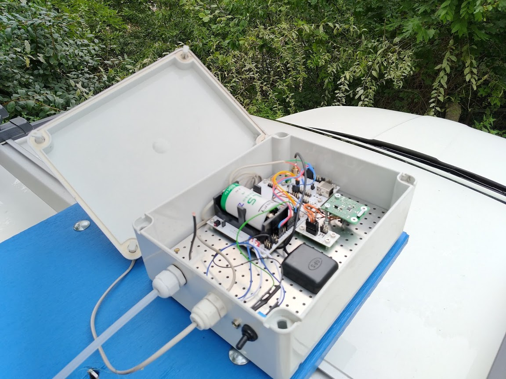
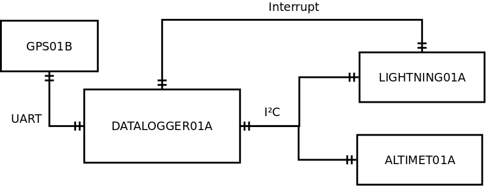

# DIVISEK01A Lightning detector

The unit is used for triggering of recording in any another scientific instruments during thunderstorm observations. 

The device consists [AS3935](https://ams.com/as3935) sensor mounted in [LIGHTNING01A](https://mlab.cz/module/LIGHTNING01A) module. 
Data are stored by [DATALOGGER01A](https://mlab.cz/module/DATALOGGER01A) module. To record basic meteorological data the device consists [ALTIMET01A](https://mlab.cz/module/ALTIMET01A) module which measures ambient temperature and pressure. 

